# Sudoku Full Crack
A Project for Computer Programming @ KMITL

#  Introduction
- Sudoku is a 9x9 grid number puzzle with 3x3 9-sub grid. The Game start with a few of digits 1 - 9 in 9x9 grid,
requires player to fill blanks in a 9x9 grid with digits. each column, each row, and each of the nine 3×3 subgrids must contains all of the digits from 1 to 9.
- Sudoku Full Crack is a GUI program with Qt that will teach you how to complete a Sudoku, step by step, it will also teach you the used technique too.

#  Objective
- This program is for people who not have experiences for Sudoku.
- This program is created for people who want to brain training, making you gain intelligence.
- Helps in the habit of deliberate planning. make a benefit from free time.

#  Requirements
* Qt >= 5.10
* MinGW 5.30 32bit g++

---

#  Installation
### Build with Qt Creator
Download and Install [Qt Creator](https://www.qt.io/download) and follow the below setting.
  
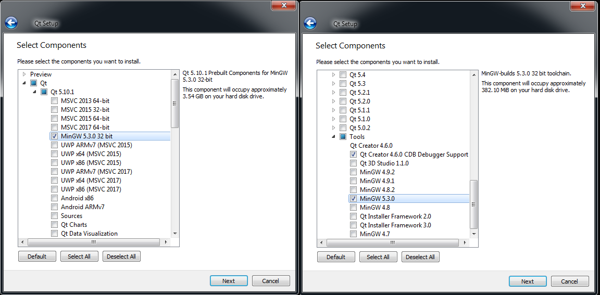

 

    git clone https://github.com/KurokoChu/Sudoku-Full-Crack

Open SudokuFullCrack.pro and build it.
  
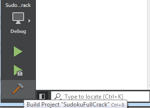

Make sure to select kit as Desktop Qt 5.10.1 MinGW 32bit.
  
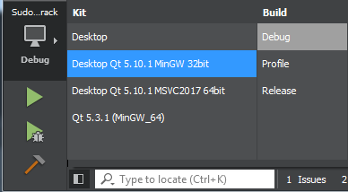

### Release version (for Windows x86 platform)
Run execute file in release folder (it doesn't require a setup).

---

#  Interface
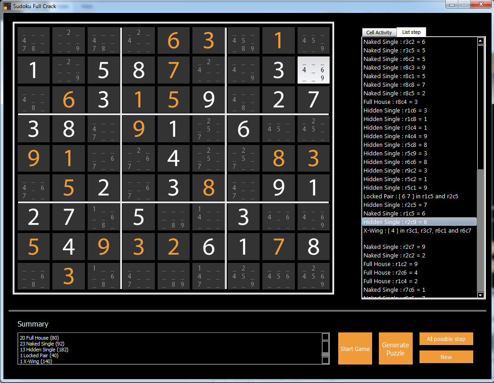 
  
The right side of the game is cell Activity number 1-9 to fill in the table.
List step it's responsible for checking the wrong slot and displaying the correct information. When Press All possible step Button.
Right bottom is 4 buttons, 
1. Start Game Button - Playable mode, you can play by yourself and check for solution, press again to see score result.
2. Generate Puzzle Button - Get Sudoku Puzzle can be different up to 8000 games.
3. All possible step Button - Show the solution in each slot.
4. New Button - Clear the table to start new game. 
### You can set value in cell by clicking the panel to select the number and press on sudoku cell. You can also use numpad instead.
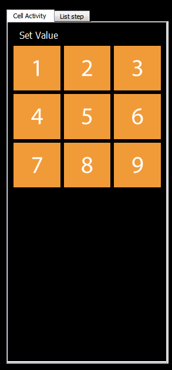 
### Learning how to solve Sudoku by double clicking the list of step in this panel.
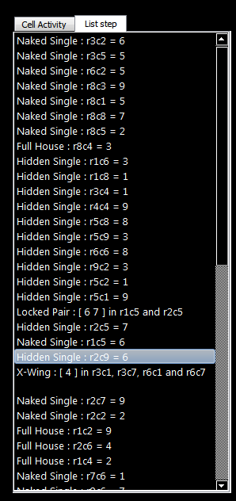 

---
#  How to use
### Select the number by click the numpad on 'Cell Activity' tab or press the numpad keyboard and fill it into cell.
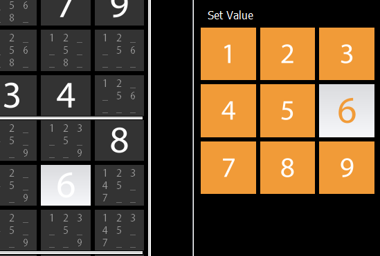

### Each cell will display what digit you can fill it into cell aka. 'Digit Candidate'.
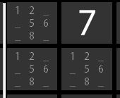

### Press 'Start' to play as Playable Mode.

### and if Sudoku don't have solution.
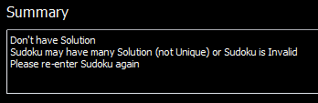

### or it isn't Sudoku (Invalid).
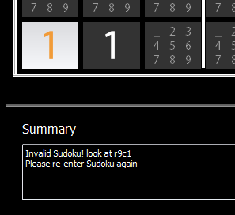

### When you enter Sudoku and press 'Start' to play as Playable Mode, timer will start.
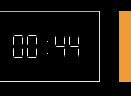

### Once you finish the game press 'Stop' to see result and timer will stop.

### or press 'All possible step' to see how so solve Sudoku.

### Double click at each step and learn it.
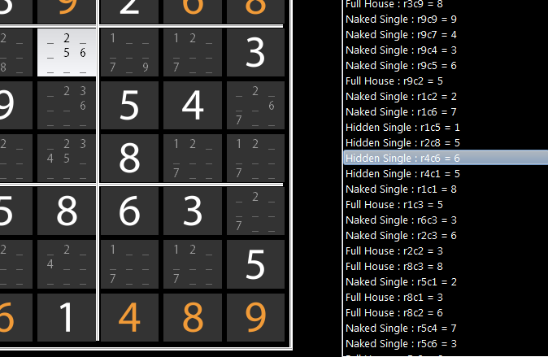

### In this screen you will see score result.
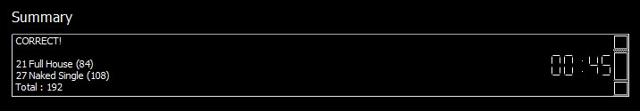

### Press 'New' to start new game.

---

#  Dataset
* [1M Games Sudoku](https://www.kaggle.com/bryanpark/sudoku)

---

#  Team Members
||||
|:-:|:-:|:-:|
|Angkrit Boonrod|Wassapol Pungjap|Supakit Rodthong|
|59070191|60070088|60070099|
|[@ITFSTUDENT191](https://github.com/ITFSTUDENT191)|[@abc666777](https://github.com/abc666777)|[@KurokoChu](https://github.com/KurokoChu)

#  Assistant Teacher
|Asst. Prof. Dr. Kitsuchart Pasupa|Asst. Prof. Dr. Panwit Tuwanut|
|:-:|:-:|
|||

---

Faculty of Information Technology

King Mongkut's Institute of Technology Ladkrabang
